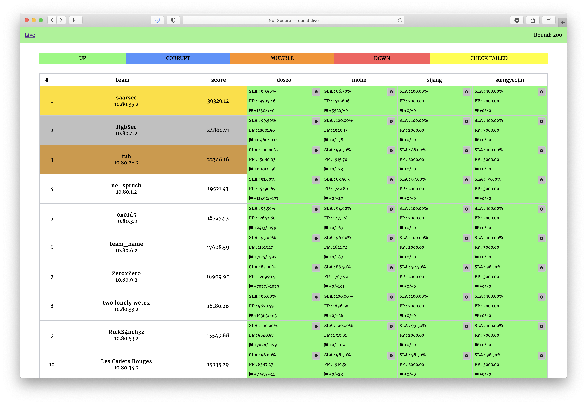

# Attack-Defence training by C4T BuT S4D
Sources of services, checkers and sploits from 18th October 2020 training.

## Results

[Full scoreboard](scoreboard/full.png)

## Services

| Service | Lang | Checker | Sploits | Author |
|--------|------|-------|---------|-------|
| **[doseo](services/doseo/)** | doseo | [Checker](checkers/doseo/) | [Sploits](sploits/doseo/) | [@amoniaka-knabino](https://github.com/amoniaka-knabino) |
| **[moim](services/moim/)** | moim | [Checker](checkers/moim/) | [Sploits](sploits/moim/) | [@jnovikov](https://github.com/jnovikov) |
| **[sijang](services/sijang/)** | sijang | [Checker](checkers/sijang/) | [Sploits](sploits/sijang/) | [@revervand](https://github.com/revervand) |
| **[sumgyeojin](services/sumgyeojin/)** | sumgyeojin | [Checker](checkers/sumgyeojin/) | [Sploits](sploits/sumgyeojin/) | [@xmikasax](https://github.com/xmikasax) |

## Infrastructure

- DevOps: [@pomo-mondreganto](https://github.com/pomo-mondreganto).
- Checksystem: [ForcAD](https://github.com/pomo-mondreganto/ForcAD)
